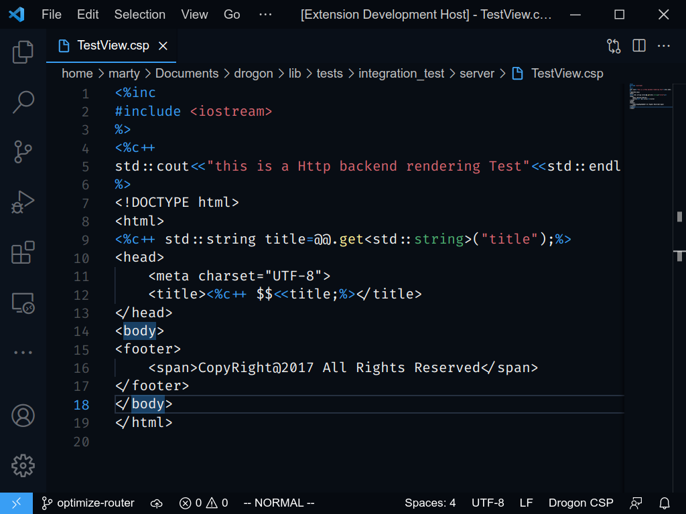
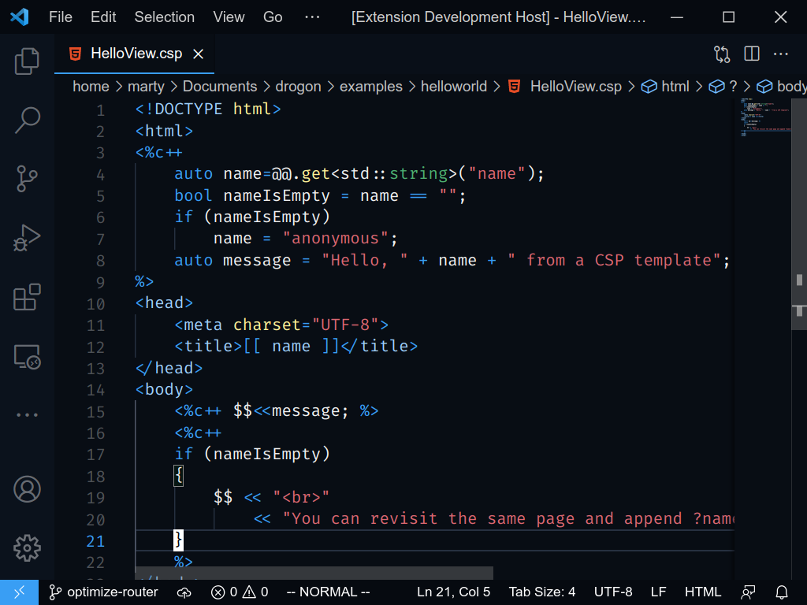

# Drogon CSP

This extenstion adds syntax highlighting support for [Drogon Web Framework](https://github.com/an-tao/drogon)'s generic CSP templating system.

## Features

CSP (C++ Server Pages) is Drogon's generic text templating system. Though commonly used for generating HTML. It's really generic and capable of generating other text files. For example, JSON or Vue. This extenstion provides syntax highlighting for CSP and injects the syntax into common CSP targets, espically HTML and Vue.

* CSP syntax highlighting
* Syntax injection into HTML and Vue sources

## Preview

###### Plan CSP

###### HTML syntax with embedded CSP

(Set the syntax to HTML and it will be automatically enabled)

## Contribution

Feel free to open an issue or a PR for bugs, embedded into new syntax or anything

